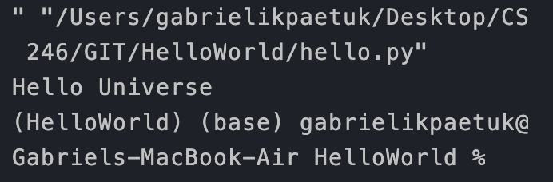

# OVERVIEW
This program outputs "Hello Universe". It uses python 3.8.5 with visual studio code and github.

# DEVELOPMENT ENVIRONMENT
* Visual Studio Code
* Python 3.8.5

# EXECUTION
To execute the program: 'python hello.py'

# USEFUL WEBSITES
* [Python reference](https://docs.python.org/3/reference/index.html)
